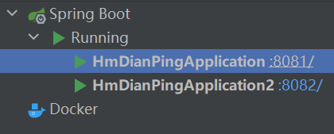

## 运行说明

### 前端启动
#### 启动 nginx (cmd)
```
start nginx
```
#### 关闭 nginx (cmd)
```
nginx -s stop  或
nginx -s quit
```

### 后端启动


#### 启动 redis (cmd)
```
redis-server.exe redis.windows.conf
```

#### 启动两个服务（使用了负载均衡，轮询访问）



### 访问地址
http://localhost:8080/
